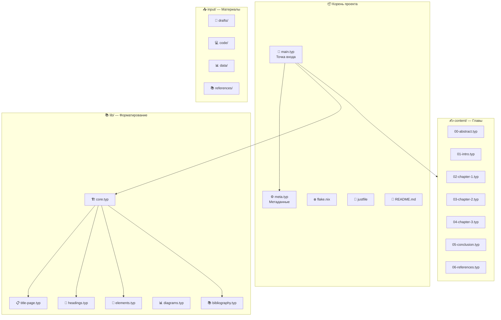
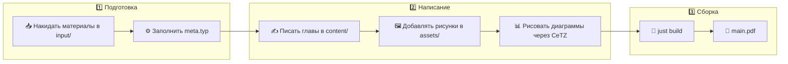

# 📚 Typst-шаблон курсовой работы МИРЭА

> 🎓 Модульный Typst-шаблон для оформления курсовых работ по **ГОСТ 7.32-2017** с поддержкой AI (Cursor), векторных диаграмм (CeTZ) и автоматической сборкой.

---

## ✨ Возможности

- 📄 **ГОСТ 7.32-2017** из коробки — поля, шрифты, интервалы, нумерация
- 🏗️ **Модульная архитектура** — контент отдельно от оформления
- 🤖 **AI-friendly** — Cursor Rules для интеллектуальной работы с проектом
- 📊 **CeTZ / CeTZ-Plot** — векторные графики и диаграммы прямо в документе
- 🔄 **Hot reload** — `just watch` для мгновенного предпросмотра
- ❄️ **Nix / NixOS** — воспроизводимое окружение через `flake.nix`
- 🪟 **Кроссплатформенный** — Windows, Linux, macOS, NixOS

---

## 🚀 Быстрый старт

### 3 шага до первого PDF:

```bash
# 1. Клонировать / скопировать шаблон
git clone https://github.com/YOUR_USERNAME/coursework-template.git my-coursework
cd my-coursework

# 2. Заполнить метаданные
#    Отредактируйте meta.typ — ваше ФИО, группа, тема, руководитель

# 3. Собрать PDF
just build
# или
typst compile main.typ
```

📄 Результат: `main.pdf` — готовый к печати документ с титульным листом, оглавлением и заготовками глав.

---

## 🖥️ Установка

### ❄️ NixOS / Nix (рекомендуется)

Самый простой способ — всё окружение описано в `flake.nix`:

```bash
# Войти в dev shell (Typst + Just + шрифты — всё включено)
nix develop

# Готово! Можно работать:
just build
just watch
```

> 💡 Шрифты (Times New Roman и др.) подключаются автоматически через `TYPST_FONT_PATHS`.

### 🐧 Linux (Ubuntu / Fedora / Arch)

```bash
# 1. Установить Typst
# Вариант A: через cargo
cargo install --locked typst-cli

# Вариант B: через пакетный менеджер
# Arch:   pacman -S typst
# Fedora: dnf install typst

# 2. Установить Just (task runner)
# Arch:   pacman -S just
# Cargo:  cargo install just

# 3. Установить шрифты Times New Roman
# Ubuntu/Debian:
sudo apt install ttf-mscorefonts-installer
# Arch:
yay -S ttf-ms-fonts
# Fedora:
sudo dnf install curl cabextract xorg-x11-font-utils fontconfig
sudo rpm -i https://downloads.sourceforge.net/project/mscorefonts2/rpms/msttcore-fonts-installer-2.6-1.noarch.rpm

# 4. Собрать
just build
```

### 🪟 Windows

```powershell
# 1. Установить Typst
winget install --id Typst.Typst

# Или через Scoop:
scoop install typst

# 2. Установить Just
cargo install just
# Или: scoop install just

# 3. Шрифты Times New Roman — уже предустановлены в Windows ✅

# 4. Собрать
just build

# Или без Just:
typst compile main.typ
```

### 🍎 macOS

```bash
# 1. Установить через Homebrew
brew install typst just

# 2. Шрифты — скачать Times New Roman или использовать Liberation Serif
brew install --cask font-liberation

# 3. Собрать
just build
```

---

## 📁 Структура проекта



### 📂 Описание папок

| Папка | Назначение | Кто редактирует |
|-------|-----------|-----------------|
| `content/` | 📝 Главы курсовой | **Вы** (или AI) |
| `lib/` | 🏗️ Оформление по ГОСТ | ⛔ Не трогать |
| `input/` | 📥 Ваши материалы | **Вы** (AI только читает) |
| `assets/` | 🖼️ Изображения | **Вы** |
| `appendices/` | 📎 Приложения | **Вы** (или AI) |

---

## ⚙️ Настройка проекта — `meta.typ`

Это **единственный файл**, который нужно отредактировать для нового проекта:

```typst
// Тип документа
#let doc-type = "coursework"

// Студент
#let student = (
  name: "Иванов Иван Иванович",
  group: "БСБО-01-21",
)

// Работа
#let title = "Разработка системы управления задачами"
#let discipline = "Программное обеспечение облачных систем"
#let variant = 7

// Руководитель
#let supervisor = (
  name: "Куликова И.Р.В.",
  title: "к.т.н., доцент",
)

// ВУЗ
#let university = "МИРЭА — Российский технологический университет"
#let institute = "Институт информационных технологий"
#let department = "Кафедра инструментального и прикладного ПО"
#let city = "Москва"
#let year = "2026"
```

### 🔧 Переопределение параметров ГОСТ

Если преподаватель требует другое оформление, измените `formatting` в `meta.typ`:

```typst
#let formatting = (
  margin-left: 25mm,        // Было 30мм
  font-size: 12pt,          // Было 14pt
  line-spacing: 1.15em,     // Было 1.5em
  // ...остальное по умолчанию
)
```

---

## 🧩 Утилиты — `lib/elements.typ`

### 🖼️ Рисунок

```typst
#import "lib/elements.typ": fig

#fig("assets/architecture.png", "Архитектура системы")
#fig("assets/diagram.png", "Диаграмма классов", width: 80%)
```

📌 Результат: «Рисунок 1 — Архитектура системы» (по центру, под рисунком)

### 📋 Таблица

```typst
#import "lib/elements.typ": tbl

#tbl(
  "Сравнение технологий контейнеризации",
  columns: (1fr, 1fr, 1fr),
  [Критерий], [Docker], [Podman],
  [Изоляция], [Хорошая], [Отличная],
  [Rootless], [Частично], [Да],
)
```

📌 Результат: «Таблица 1 — Сравнение технологий контейнеризации» (слева, над таблицей)

### 💻 Листинг кода

```typst
#import "lib/elements.typ": code-block

#code-block("Подключение к базе данных")[
  ```python
  import psycopg2
  conn = psycopg2.connect("dbname=mydb")
  cursor = conn.cursor()
  ```
]
```

📌 Результат: «Листинг 1 — Подключение к базе данных»

---

## 📊 Диаграммы — `lib/diagrams.typ`

Шаблон включает обёртки для [CeTZ](https://github.com/cetz-package/cetz) и [CeTZ-Plot](https://github.com/cetz-package/cetz-plot) — мощных библиотек для рисования векторной графики прямо в Typst.

> 🎨 **Галерея примеров**: [diagrams.janosh.dev](https://diagrams.janosh.dev/) — 130+ научных диаграмм на CeTZ

### 📈 График функции

```typst
#import "lib/diagrams.typ": gost-plot
#import "@preview/cetz-plot:0.1.3": plot

#figure(
  gost-plot(
    size: (10, 6),
    x-label: [Время, с],
    y-label: [Нагрузка, %],
    x-tick-step: 1,
    y-tick-step: 20,
    {
      plot.add(domain: (0, 5), x => 20 * calc.sin(x) + 50)
      plot.add(domain: (0, 5), x => 10 * x + 10, style: (stroke: red))
    }
  ),
  caption: "Зависимость нагрузки от времени",
  supplement: "Рисунок",
)
```

### 🥧 Круговая диаграмма

```typst
#import "lib/diagrams.typ": gost-piechart

#figure(
  gost-piechart((
    ([Docker], 45),
    ([Kubernetes], 30),
    ([Podman], 15),
    ([Другое], 10),
  )),
  caption: "Распределение технологий контейнеризации",
  supplement: "Рисунок",
)
```

### 📊 Столбчатая диаграмма

```typst
#import "lib/diagrams.typ": gost-barchart

#figure(
  gost-barchart(
    (([2022], 150), ([2023], 230), ([2024], 310)),
    x-label: [Количество запросов],
  ),
  caption: "Динамика запросов по годам",
  supplement: "Рисунок",
)
```

### 🔄 Блок-схема алгоритма

```typst
#import "lib/diagrams.typ": gost-canvas, flowchart-block, flowchart-arrow
#import "@preview/cetz:0.4.2"

#figure(
  gost-canvas({
    flowchart-block(cetz, (0, 0), [Начало], shape: "stadium")
    flowchart-arrow((0, -0.5), (0, -1.5))
    flowchart-block(cetz, (0, -2), [Ввод данных])
    flowchart-arrow((0, -2.5), (0, -3.3))
    flowchart-block(cetz, (0, -4), [Данные верны?], shape: "diamond")
    flowchart-arrow((0, -4.7), (0, -5.5))
    flowchart-block(cetz, (0, -6), [Обработка])
    flowchart-arrow((0, -6.5), (0, -7.5))
    flowchart-block(cetz, (0, -8), [Конец], shape: "stadium")
  }),
  caption: "Блок-схема алгоритма обработки данных",
  supplement: "Рисунок",
)
```

---

## 📥 Папка `input/` — ваши материалы

Сюда складываете **всё, что у вас есть** для курсовой:

| Подпапка | Что класть |
|----------|-----------|
| `input/drafts/` | 📝 Черновики, заметки, наброски текстов |
| `input/code/` | 💻 Исходный код вашего проекта |
| `input/data/` | 📊 Данные, скриншоты, диаграммы |
| `input/references/` | 📚 PDF методичек, статьи, книги |

> ⚠️ **AI (Cursor) может ЧИТАТЬ файлы из input/, но НИКОГДА не изменяет их.** Это ваши оригиналы.

```bash
# Посмотреть что есть в input/
just input-status

# Скопировать изображения из input/data/ в assets/
just copy-images
```

---

## 🤖 Работа с Cursor AI

Проект включает **Cursor Rules** (`.cursor/rules/`), которые направляют AI:

### 📋 Правила для AI

| Файл | Что делает |
|------|-----------|
| `project-structure.mdc` | 🏗️ Описывает структуру проекта, назначение файлов |
| `input-readonly.mdc` | 🔒 `input/` — строго read-only для AI |
| `typst-style.mdc` | 📝 Конвенции Typst-кода: использовать утилиты, не хардкодить |

### 🧠 Typst MCP

Если у вас подключён **Typst MCP сервер**, AI может:
- 📖 Искать документацию по функциям Typst
- ✅ Проверять валидность Typst-кода
- 🔄 Конвертировать формулы из LaTeX в Typst

### 💡 Как просить AI писать курсовую

```
# Хорошие промпты:
"Напиши введение для курсовой, используя материалы из input/drafts/"
"Добавь диаграмму архитектуры в главу 2 через CeTZ"
"Заполни таблицу сравнения технологий в главе 1"

# AI будет:
# ✅ Читать материалы из input/
# ✅ Использовать утилиты из lib/elements.typ
# ✅ Писать контент в content/ файлы
# ❌ НЕ трогать файлы в lib/ и input/
```

---

## 🔨 Команды (justfile)

| Команда | Описание |
|---------|---------|
| `just build` | 📄 Скомпилировать PDF |
| `just watch` | 🔄 Автообновление при изменениях |
| `just run` | 📄 Скомпилировать и открыть |
| `just open` | 📂 Открыть PDF |
| `just clean` | 🗑️ Удалить PDF |
| `just fmt` | ✨ Отформатировать .typ файлы |
| `just input-status` | 📥 Показать материалы в input/ |
| `just copy-images` | 🖼️ Скопировать картинки в assets/ |
| `just tree` | 📁 Показать структуру проекта |
| `just help` | ❓ Справка по командам |

---

## 📐 Параметры ГОСТ 7.32-2017

Шаблон настроен по ГОСТ 7.32-2017 из коробки:

| Параметр | Значение |
|----------|---------|
| 📄 Страница | A4 |
| ↔️ Поля | лево 30мм, право 10мм, верх/низ 20мм |
| 🔤 Шрифт | Times New Roman, 14pt |
| ↕️ Межстрочный | 1.5 интервала |
| ➡️ Абзацный отступ | 1.25 см |
| 🔢 Нумерация страниц | Снизу по центру |
| 📑 Заголовки 1 ур. | ПРОПИСНЫЕ, жирные, по центру |
| 🖼️ Подпись рисунка | «Рисунок N — Название» (под, по центру) |
| 📋 Подпись таблицы | «Таблица N — Название» (над, слева) |
| 📝 Маркер списка | Тире (--) |

---

## 🔄 Рабочий процесс



---

## ❓ FAQ

### 🔤 Шрифт Times New Roman не найден

**NixOS:** Убедитесь, что вы зашли в `nix develop` — шрифты подключаются через `TYPST_FONT_PATHS`.

**Linux:** Установите `ttf-mscorefonts-installer` (Ubuntu) или `ttf-ms-fonts` (Arch).

**Альтернатива:** Измените шрифт в `meta.typ`:
```typst
#let formatting = (
  font-family: "Liberation Serif",  // Свободная альтернатива Times New Roman
  // ...
)
```

### 📄 Как добавить ещё одну главу?

1. Создайте файл `content/04-chapter-3.typ` (или с нужным номером)
2. Добавьте `#include "content/04-chapter-3.typ"` в `main.typ`

### 📋 Как переключить на ручной список источников?

В `content/06-references.typ` уже есть оба способа — автоматический (через `.yml`) и ручной (нумерованный список). Просто используйте нужный.

### 📊 Где найти примеры CeTZ-диаграмм?

- 🎨 **Галерея**: [diagrams.janosh.dev](https://diagrams.janosh.dev/) — 130+ примеров
- 📖 **Документация CeTZ-Plot**: [github.com/cetz-package/cetz-plot](https://github.com/cetz-package/cetz-plot)
- 📖 **Документация CeTZ**: [github.com/cetz-package/cetz](https://github.com/cetz-package/cetz)

### 🤖 Как настроить Cursor для работы с шаблоном?

Просто откройте проект в Cursor — правила из `.cursor/rules/` подхватятся автоматически. Если у вас установлен Typst MCP сервер, AI сможет проверять синтаксис и искать документацию.

---

## 📜 Лицензия

MIT — используйте как хотите. 🎓
