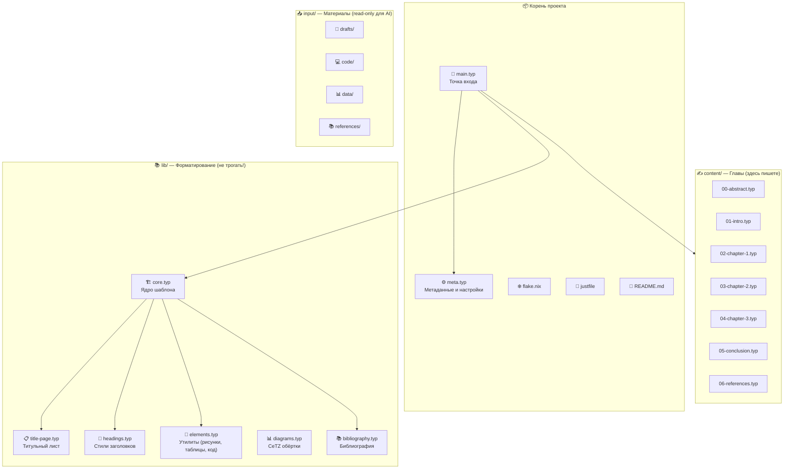
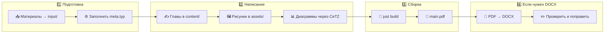

# 📚 Typst-шаблон курсовой работы МИРЭА


> 🎓 Модульный Typst-шаблон для оформления курсовых работ по стандартам МИРЭА с поддержкой AI (Cursor), векторных диаграмм (CeTZ) и автоматической сборкой.

---

> [!WARNING]
> **🚧 Проект в стадии активной разработки (WIP)**
>
> Шаблон ещё дорабатывается. Возможны баги, неточности в оформлении и неполная документация.
> Если нашли ошибку — создайте Issue или Pull Request. Перед сдачей работы **обязательно сверьте оформление** с методичкой вашей кафедры.

---

## ✨ Возможности

- 📄 **Оформление по МИРЭА** из коробки — Times New Roman 14pt, поля, интервалы, нумерация
- 🏗️ **Модульная архитектура** — контент отдельно от оформления
- 🤖 **AI-friendly** — Cursor Rules для интеллектуальной работы с проектом
- 📊 **CeTZ / CeTZ-Plot** — векторные графики и диаграммы прямо в документе
- 🔄 **Hot reload** — `just watch` для мгновенного предпросмотра
- ❄️ **Nix / NixOS** — воспроизводимое окружение через `flake.nix`
- 🪟 **Кроссплатформенный** — Windows, Linux, macOS, NixOS
- 🔢 **Секционная нумерация** — «Рисунок 2.1», «Таблица 1.3», формулы (1.5)
- 📖 **Цитирование** — `cite-src(1)` → [1], `cite-range(3, 7)` → [3-7]
- 📎 **Приложения** — ГОСТ-буквы (А, Б, В...), автооглавление

---

## 📦 Формат вывода

Typst компилирует документ в **PDF**. Это основной формат для сдачи.

> [!NOTE]
> **Нужен DOCX?**
>
> Typst **не поддерживает** прямую конвертацию в DOCX. Если преподаватель требует `.docx`:
>
> 1. Соберите PDF: `just build`
> 2. Сконвертируйте PDF → DOCX через один из сервисов:
>    - 🔗 [Adobe Acrobat Online](https://www.adobe.com/acrobat/online/pdf-to-word.html) (бесплатно, лучшее качество)
>    - 🔗 [SmallPDF](https://smallpdf.com/pdf-to-word)
>    - 🔗 [iLovePDF](https://www.ilovepdf.com/pdf_to_word)
> 3. **Обязательно перепроверьте** полученный DOCX — конвертация хорошая, но не идеальная:
>    - Могут поехать таблицы, отступы, формулы
>    - Изображения могут сместиться
>    - Нумерация страниц может потребовать ручной правки
>
> 💡 *Совет*: если нужен DOCX, лучше сконвертировать один раз в конце и поправить вручную, чем конвертировать на каждом этапе.

---

## 🚀 Быстрый старт

### 3 шага до первого PDF:

```bash
# 1. Клонировать / скопировать шаблон
git clone https://github.com/YOUR_USERNAME/coursework-template.git my-coursework
cd my-coursework

# 2. Заполнить метаданные
#    Отредактируйте meta.typ — ваше ФИО, группа, тема, руководитель

# 3. Собрать PDF
just build
# или
typst compile main.typ
```

📄 Результат: `main.pdf` — готовый к печати документ с титульным листом, оглавлением и заготовками глав.

---

## 🖥️ Установка

### ❄️ NixOS / Nix (рекомендуется)

Самый простой способ — всё окружение описано в `flake.nix`:

```bash
# Войти в dev shell (Typst + Just + шрифты — всё включено)
nix develop

# Готово! Можно работать:
just build
just watch
```

> 💡 Шрифты (Times New Roman и др.) подключаются автоматически через `TYPST_FONT_PATHS`.

### 🐧 Linux (Ubuntu / Fedora / Arch)

```bash
# 1. Установить Typst
# Вариант A: через cargo
cargo install --locked typst-cli

# Вариант B: через пакетный менеджер
# Arch:   pacman -S typst
# Fedora: dnf install typst

# 2. Установить Just (task runner)
# Arch:   pacman -S just
# Cargo:  cargo install just

# 3. Установить шрифты Times New Roman
# Ubuntu/Debian:
sudo apt install ttf-mscorefonts-installer
# Arch:
yay -S ttf-ms-fonts
# Fedora:
sudo dnf install curl cabextract xorg-x11-font-utils fontconfig
sudo rpm -i https://downloads.sourceforge.net/project/mscorefonts2/rpms/msttcore-fonts-installer-2.6-1.noarch.rpm

# 4. Собрать
just build
```

### 🪟 Windows

```powershell
# 1. Установить Typst
winget install --id Typst.Typst

# Или через Scoop:
scoop install typst

# 2. Установить Just
cargo install just
# Или: scoop install just

# 3. Шрифты Times New Roman — уже предустановлены в Windows ✅

# 4. Собрать
just build

# Или без Just:
typst compile main.typ
```

### 🍎 macOS

```bash
# 1. Установить через Homebrew
brew install typst just

# 2. Шрифты — скачать Times New Roman или использовать Liberation Serif
brew install --cask font-liberation

# 3. Собрать
just build
```

---

## 📁 Структура проекта



### 📂 Описание папок

| Папка | Назначение | Кто редактирует |
|-------|-----------|-----------------|
| `content/` | 📝 Главы курсовой | **Вы** (или AI) |
| `lib/` | 🏗️ Оформление по стандарту | ⛔ Не трогать |
| `input/` | 📥 Ваши материалы | **Вы** (AI только читает) |
| `assets/` | 🖼️ Изображения | **Вы** |
| `.cursor/rules/` | 🤖 Правила для AI | ⛔ Не трогать |

---

## ⚙️ Настройка проекта — `meta.typ`

Это **единственный файл**, который нужно отредактировать для нового проекта:

```typst
// Тип документа
#let doc-type = "coursework"

// Студент
#let student = (
  name: "Иванов Иван Иванович",
  group: "БСБО-01-21",
)

// Работа
#let title = "Разработка системы управления задачами"
#let discipline = "Программное обеспечение облачных систем"
#let variant = 7

// Руководитель
#let supervisor = (
  name: "Петров П.П.",
  title: "к.т.н., доцент",
)

// ВУЗ
#let university = "МИРЭА — Российский технологический университет"
#let institute = "Институт информационных технологий"
#let department = "Кафедра инструментального и прикладного ПО"
#let city = "Москва"
#let year = "2026"
```

### 🔧 Переопределение параметров оформления

Если преподаватель требует другие поля, шрифт или интервалы — измените `formatting` в `meta.typ`:

```typst
#let formatting = (
  // Некоторые кафедры МИРЭА требуют 25/15 вместо ГОСТ 30/10
  margin-left: 25mm,
  margin-right: 15mm,

  // Другой размер шрифта
  font-size: 12pt,

  // Другой интервал
  line-spacing: 1.15em,
  // ...остальное по умолчанию
)
```

### 📝 Список сокращений (необязательно)

Если в работе используются аббревиатуры — заполните в `meta.typ`:

```typst
#let abbreviations = (
  (abbr: "API", full: [Application Programming Interface — программный интерфейс приложения]),
  (abbr: "БД", full: [База данных]),
  (abbr: "ПО", full: [Программное обеспечение]),
)
```

Список автоматически появится после оглавления. Если массив пуст — раздел не генерируется.

---

## 🧩 Утилиты — `lib/elements.typ`

### 🖼️ Рисунок

```typst
#import "../lib/elements.typ": fig, fig-placeholder

// Обычный рисунок
#fig("assets/architecture.png", "Архитектура системы")
#fig("assets/diagram.png", "Диаграмма классов", width: 80%)

// Заглушка (пока нет изображения)
#fig-placeholder("Диаграмма компонентов системы")
```

📌 Результат: «**Рисунок 1.1 — Архитектура системы**» (под рисунком, по центру, 12pt полужирный)

### 📋 Таблица

```typst
#import "../lib/elements.typ": tbl, long-tbl

// Обычная таблица
#tbl(
  "Сравнение технологий контейнеризации",
  columns: (1fr, 1fr, 1fr),
  zebra: true,  // полосатые строки
  [Критерий], [Docker], [Podman],
  [Изоляция], [Хорошая], [Отличная],
  [Rootless], [Частично], [Да],
)

// Длинная таблица (заголовок повторяется при разрыве страницы)
#long-tbl(
  "Результаты тестирования",
  columns: (1fr, 1fr, auto),
  header: ([Тест], [Результат], [Время]),
  [Unit], [OK], [0.5с],
  [Integration], [OK], [2.1с],
  // ...много строк...
)
```

📌 Результат: «Таблица 1.1 — Сравнение технологий контейнеризации» (над таблицей, слева)

### 💻 Листинг кода

```typst
#import "../lib/elements.typ": code-block, code-file

// Блок кода с подписью
#code-block("Подключение к базе данных")[
  ```python
  import psycopg2
  conn = psycopg2.connect("dbname=mydb")
  cursor = conn.cursor()
  ```
]

// Листинг из внешнего файла (язык определяется автоматически)
#code-file("input/code/main.py", "Главный модуль приложения")
```

📌 Результат: «Листинг 2.1 — Подключение к базе данных» (с нумерацией строк и подсветкой)

### 📖 Цитирование источников

```typst
#import "../lib/elements.typ": cite-src, cite-range

Как показано в #cite-src(1), данный подход эффективен.   // → [1]
Исследования #cite-src(1, 2, 3) подтверждают это.       // → [1, 2, 3]
Согласно источникам #cite-range(5, 7), ...              // → [5-7]
```

### 🔗 Кросс-ссылки

```typst
#import "../lib/elements.typ": fig-num, table-num, listing-num

На рисунке #fig-num(<fig:arch>) показана архитектура.    // → 2.1
В таблице #table-num(<tbl:compare>) приведено сравнение. // → 1.3
Листинг #listing-num(<lst:db>) содержит код.             // → 3.2
```

### 📎 Приложения

```typst
#import "../lib/elements.typ": appendix, appendix-toc

// Оглавление приложений
#appendix-toc(("Листинги кода", "Результаты тестирования"))

// Приложение А
#appendix("А", "Листинги кода")[
  #code-file("input/code/main.py", "Главный модуль")
]
```

📌 Буквы по ГОСТ: А, Б, В, Г, Д, Ж, И, К, Л... (исключены Ё, З, Й, О, Ч, Ь, Ы, Ъ)

---

## 📊 Диаграммы — `lib/diagrams.typ`

Шаблон включает обёртки для [CeTZ](https://github.com/cetz-package/cetz) и [CeTZ-Plot](https://github.com/cetz-package/cetz-plot) — библиотек для рисования векторной графики прямо в Typst.

> 🎨 **Галерея примеров**: [diagrams.janosh.dev](https://diagrams.janosh.dev/) — 130+ научных диаграмм на CeTZ

### 📈 График функции

```typst
#import "../lib/diagrams.typ": gost-plot
#import "@preview/cetz-plot:0.1.3": plot

#figure(
  gost-plot(
    size: (10, 6),
    x-label: [Время, с],
    y-label: [Нагрузка, %],
    x-tick-step: 1,
    y-tick-step: 20,
    {
      plot.add(domain: (0, 5), x => 20 * calc.sin(x) + 50)
      plot.add(domain: (0, 5), x => 10 * x + 10, style: (stroke: red))
    }
  ),
  caption: "Зависимость нагрузки от времени",
)
```

### 🥧 Круговая диаграмма

```typst
#import "../lib/diagrams.typ": gost-piechart

#figure(
  gost-piechart((
    ([Docker], 45),
    ([Kubernetes], 30),
    ([Podman], 15),
    ([Другое], 10),
  )),
  caption: "Распределение технологий контейнеризации",
)
```

### 📊 Столбчатая диаграмма

```typst
#import "../lib/diagrams.typ": gost-barchart

#figure(
  gost-barchart(
    (([2022], 150), ([2023], 230), ([2024], 310)),
    x-label: [Количество запросов],
  ),
  caption: "Динамика запросов по годам",
)
```

### 🔄 Блок-схема алгоритма

```typst
#import "../lib/diagrams.typ": gost-canvas, flowchart-block, flowchart-arrow
#import "@preview/cetz:0.4.2"

#figure(
  gost-canvas({
    flowchart-block(cetz, (0, 0), [Начало], shape: "stadium")
    flowchart-arrow((0, -0.5), (0, -1.5))
    flowchart-block(cetz, (0, -2), [Ввод данных])
    flowchart-arrow((0, -2.5), (0, -3.3))
    flowchart-block(cetz, (0, -4), [Данные верны?], shape: "diamond")
    flowchart-arrow((0, -4.7), (0, -5.5))
    flowchart-block(cetz, (0, -6), [Обработка])
    flowchart-arrow((0, -6.5), (0, -7.5))
    flowchart-block(cetz, (0, -8), [Конец], shape: "stadium")
  }),
  caption: "Блок-схема алгоритма обработки данных",
)
```

---

## 📥 Папка `input/` — ваши материалы

Сюда складываете **всё, что у вас есть** для курсовой:

| Подпапка | Что класть |
|----------|-----------|
| `input/drafts/` | 📝 Черновики, заметки, наброски текстов |
| `input/code/` | 💻 Исходный код вашего проекта |
| `input/data/` | 📊 Данные, скриншоты, диаграммы |
| `input/references/` | 📚 PDF методичек, статьи, книги |

> ⚠️ **AI (Cursor) может ЧИТАТЬ файлы из input/, но НИКОГДА не изменяет их.** Это ваши оригиналы.

```bash
# Посмотреть что есть в input/
just input-status

# Скопировать изображения из input/data/ в assets/
just copy-images
```

---

## 🤖 Работа с Cursor AI

Проект включает **Cursor Rules** (`.cursor/rules/`), которые направляют AI:

### 📋 Правила для AI

| Файл | Что делает |
|------|-----------|
| `project-structure.mdc` | 🏗️ Описывает структуру проекта, назначение файлов |
| `input-readonly.mdc` | 🔒 `input/` — строго read-only для AI |
| `typst-style.mdc` | 📝 Конвенции Typst-кода: использовать утилиты, не хардкодить |
| `parallel-agents.mdc` | ⚡ Параллельная работа суб-агентов для ускорения |

### 🧠 Typst MCP

Если у вас подключён **Typst MCP сервер**, AI может:
- 📖 Искать документацию по функциям Typst
- ✅ Проверять валидность Typst-кода
- 🔄 Конвертировать формулы из LaTeX в Typst

### 💡 Как просить AI писать курсовую

```
# Хорошие промпты:
"Напиши введение для курсовой, используя материалы из input/drafts/"
"Добавь диаграмму архитектуры в главу 2 через CeTZ"
"Заполни таблицу сравнения технологий в главе 1"

# AI будет:
# ✅ Читать материалы из input/
# ✅ Использовать утилиты из lib/elements.typ
# ✅ Писать контент в content/ файлы
# ❌ НЕ трогать файлы в lib/ и input/
```

---

## 🔨 Команды (justfile)

| Команда | Описание |
|---------|---------|
| `just build` | 📄 Скомпилировать PDF |
| `just watch` | 🔄 Автообновление при изменениях |
| `just run` | 📄 Скомпилировать и открыть |
| `just open` | 📂 Открыть PDF |
| `just clean` | 🗑️ Удалить PDF |
| `just fmt` | ✨ Отформатировать .typ файлы (Typstyle) |
| `just fmt-check` | 🔍 Проверить форматирование |
| `just input-status` | 📥 Показать материалы в input/ |
| `just copy-images` | 🖼️ Скопировать картинки в assets/ |
| `just tree` | 📁 Показать структуру проекта |
| `just help` | ❓ Справка по командам |

---

## 📐 Параметры оформления

Шаблон настроен по требованиям МИРЭА из коробки. Все параметры переопределяемы через `meta.typ`:

| Параметр | Значение по умолчанию | Примечание |
|----------|-----------------------|------------|
| 📄 Страница | A4 | |
| ↔️ Поля | лево 30мм, право 10мм, верх/низ 20мм | Некоторые кафедры: 25мм / 15мм |
| 🔤 Шрифт | **Times New Roman**, 14pt | Фоллбэки: Liberation Serif, Noto Serif |
| ↕️ Межстрочный | 1.5 интервала | |
| ➡️ Абзацный отступ | 1.25 см | |
| 🔢 Нумерация страниц | Снизу по центру, 12pt | С титульного, но без номера на нём |
| 📑 Заголовки 1 ур. | ПРОПИСНЫЕ, жирные, 18pt | Новая страница, сброс счётчиков |
| 📑 Заголовки 2 ур. | Строчные, жирные, 16pt | |
| 📑 Заголовки 3 ур. | Строчные, жирные, 14pt | |
| 🖼️ Подпись рисунка | «**Рисунок N.M — Название**» | Под рисунком, по центру, 12pt полужирный |
| 📋 Подпись таблицы | «Таблица N.M — Название» | Над таблицей, слева, без абзацного отступа |
| 💻 Подпись листинга | «Листинг N.M — Название» | Над листингом |
| 🔢 Формулы | (N.M) — секционная нумерация | Справа по строке |
| 📝 Маркер списка | Тире (—) | |
| 📎 Приложения | ПРИЛОЖЕНИЕ А, Б, В... | 16pt полужирный, по центру |

---

## 🔄 Рабочий процесс



---

## ❓ FAQ

### 🔤 Шрифт Times New Roman не найден

**NixOS:** Убедитесь, что вы зашли в `nix develop` — шрифты подключаются через `TYPST_FONT_PATHS`.

**Linux:** Установите `ttf-mscorefonts-installer` (Ubuntu) или `ttf-ms-fonts` (Arch).

**Альтернатива:** Шаблон автоматически использует фоллбэки (Liberation Serif → Noto Serif → DejaVu Serif). Если хотите явно указать шрифт:
```typst
#let formatting = (
  font-family: "Liberation Serif",  // Свободная альтернатива TNR
  // ...
)
```

### 📄 Как добавить ещё одну главу?

1. Создайте файл `content/07-chapter-4.typ` (или с нужным номером)
2. Добавьте `#include "content/07-chapter-4.typ"` в `main.typ`

### 📋 Как переключить на ручной список источников?

В `content/06-references.typ` уже есть оба способа — автоматический (через `.yml`) и ручной (нумерованный список). Просто используйте нужный.

### 📊 Где найти примеры CeTZ-диаграмм?

- 🎨 **Галерея**: [diagrams.janosh.dev](https://diagrams.janosh.dev/) — 130+ примеров
- 📖 **Документация CeTZ-Plot**: [github.com/cetz-package/cetz-plot](https://github.com/cetz-package/cetz-plot)
- 📖 **Документация CeTZ**: [github.com/cetz-package/cetz](https://github.com/cetz-package/cetz)

### 📄 Как получить DOCX из PDF?

Typst пока не поддерживает экспорт в DOCX. Лучшие варианты конвертации PDF → DOCX:

1. **[Adobe Acrobat Online](https://www.adobe.com/acrobat/online/pdf-to-word.html)** — бесплатно, лучшее качество
2. **[SmallPDF](https://smallpdf.com/pdf-to-word)** — быстро и удобно
3. **[iLovePDF](https://www.ilovepdf.com/pdf_to_word)** — альтернатива
4. **LibreOffice** — `libreoffice --infilter="writer_pdf_import" --convert-to docx file.pdf` (офлайн, но качество хуже)

> ⚠️ После конвертации **всегда перепроверяйте** документ: таблицы, формулы и отступы могут поехать.

### 🤖 Как настроить Cursor для работы с шаблоном?

Просто откройте проект в Cursor — правила из `.cursor/rules/` подхватятся автоматически. Если у вас установлен Typst MCP сервер, AI сможет проверять синтаксис и искать документацию.

### ⚙️ Мой преподаватель требует другие поля (25мм / 15мм)

Откройте `meta.typ` и измените `formatting`:
```typst
#let formatting = (
  margin-left: 25mm,
  margin-right: 15mm,
  // ...
)
```

---

## 📜 Лицензия

MIT — используйте как хотите. 🎓
